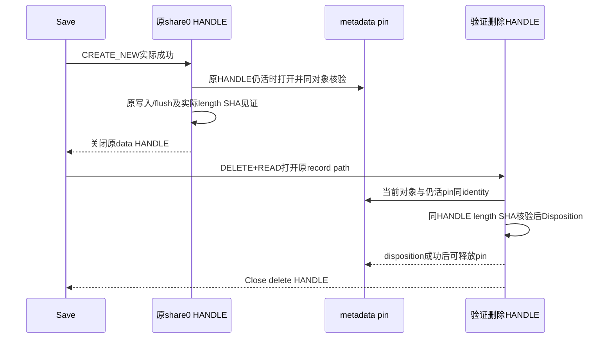

# F069 UInk cleanup 对象归属设计（待独立审查）

Active task: .trellis/tasks/09-27-integration-and-release-check。2026-10-01。

## 1. 边界与已读实码

本回合唯一可写本新设计；源码、旧报告/spec/账本/工程只读，未build/run/Git/GUI/递归。F067 sibling命名已真实红绿并独立A10C闭合，本设计保留同父GUID-only+原suffix，不重新做命名或改最终路径/索引/Win7/manifest/registry。

| 当前读入 | SHA-256 |
| --- | --- |
| shared uink_file.cpp | CAE84F1A3F9664E5BA1B7CDB085CE50A917EE05ADC247B07FCDE766EEF314F79 |
| shared uink_file.cppm | E4E4ED5AA5A1E8FCA5E9FD6B72105A69959D07974EA1BBA3BD9E1F375EA1AE0F |
| uink_tests.cpp | 5A2855B2FC9A81A35E4989EA3C98A6B359E482110A894BDD67B0C963FAD5381A |
| Root metadata native result.json | AFA1986AFDAE7FF0BF1D0663D1AA5BE906DA8DDE7323C318EF679323472AB235 |

已读F067 design+复审附录、native资源/Win7合同及真实DeletePathOnExit:95–108、WriteNewFile:492–540、ReadRevisionAtPath:780–787、所有SaveUInkFile cleanup/recovery路径。现有问题有四实际删除站点：temp destructor:101（在:932于CREATE_NEW前已active）；Replace失败但目标仍predecessor时:1036按PathExists删backup；恢复Move成功后:1058按path删newRecovery；最终验证成功后:1099按path删backup。候选名、PathExists或相同文件内容不是对象归属证明。

## 2. Root真实metadata兼容实验与平台范围

Root已outside执行私有Win32实验，文件 `TestResults/release-hardening/uink-metadata-lease-8d96c7199ac746cb894c124b785193f7/result.json`。GENERIC_READ|WRITE/share0/CREATE_NEW writer仍活时，FILE_READ_ATTRIBUTES-only、share READ|WRITE|DELETE、OPEN_REPARSE_POINT metadata lease可开且同FileID；关闭writer后仍持metadata不阻同目录Move；oldName的新foreign与仍pinned原对象ID不同；DELETE|READ_ATTRIBUTES/shareREAD的同句柄FileDispositionInfo可删除原对象，foreign保留。JSON八个bool均true、两个实际error0，host/OS记录Win11 ARM64 10.0.26200。

这是实际native前提，不是production helper/强内容验证/Win7 PASS。后续生产删除句柄还需GENERIC_READ来核SHA，这个完整组合需真实helper测试；原share0强read+metadata兼容也在实现后验证。

微软[CreateFileW](https://learn.microsoft.com/en-us/windows/win32/api/fileapi/nf-fileapi-createfilew)说明属性/扩展属性访问不受数据sharing flags限制，可解释metadata-only与share0共存；DELETE权限及普通FileDispositionInfo由[SetFileInformationByHandle](https://learn.microsoft.com/en-us/windows/win32/api/fileapi/nf-fileapi-setfileinformationbyhandle)支持，最低Vista，覆盖本项目Win7 API基线。不用FileDispositionInfoEx/POSIX flags/Win8 FileIdInfo、不假设额外KB，也不以这些文档替真Win7。

## 3. 最小私有对象记录

在shared cpp匿名namespace复用UniqueHandle、RevisionFromHandle/HashHandle，不建立新文件框架/目录回收系统。私有record仅存：实际对象metadata HANDLE、其可信filesystem/普通对象能力、记录path、预期volume/fileIndex、实际内容length/SHA、来源/可清理状态。metadata handle始终活到实际cleanup或Save函数返回；禁止仅保存整数ID后关handle再重开当永久唯一证明。

metadata pin只用FILE_READ_ATTRIBUTES、OPEN_EXISTING、FILE_FLAG_OPEN_REPARSE_POINT（普通文件，不申请backup privilege），share READ|WRITE|DELETE，非继承。对原writer/strong-read与新metadata HANDLE均核FILE_TYPE_DISK、GetFileInformationByHandle、非directory/nonreparse，同volume/fileIndex。原data句柄还活时取得pin，证明不是name后来被不同对象替换。

**Filesystem能力必须明确。** [BY_HANDLE_FILE_INFORMATION文档](https://learn.microsoft.com/en-us/windows/win32/api/fileapi/ns-fileapi-by_handle_file_information)指出ReFS64-bit ID不保证唯一、FAT重命名可变ID且ID可随时间复用。不能把这个方案宣称所有filesystem安全。提案仅在原对象HANDLE用Vista起[GetVolumeInformationByHandleW](https://learn.microsoft.com/en-us/windows/win32/api/fileapi/nf-fileapi-getvolumeinformationbyhandlew)确认NTFS/完整非零identity、普通单link对象时取得自动cleanup资格；query失败、非NTFS、partial metadata、multiple hardlink等不确定来源保留artifact。保存原API仍可进行，不能因cleanup资格缺失改逻辑文件数据或绕过验证。这个查询是私有能力检查，不改Win7底线；SMB/ReFS/FAT的清理保持保留并单列兼容验证，不从本机推断。

live pin防止对已经关闭的旧ID作无限reuse推导；同时内容见证必须来自原排他HANDLE，不能以metadata-only pin（其share允许后来write）证明原地内容不变。cleanup时同删除HANDLE再核length/SHA，原地未知改写也必须保留。

## 4. Temp创建、arm与时序

1. SaveUInkFile先准备path/guard容器但inactive，维持原allocation/错误边界。原CREATE_NEW失败（含已存在对象）时不赋任何cleanup权限，不读/删该路径。
2. WriteNewFile在原GENERIC_READ|WRITE/share0创建成功后，从原HANDLE取得身份；仍活时开metadata pin并比对同对象，捕失败原error。获取失败不arm、保留artifact，不调用DeleteFileW兜底，不改原write/flush结果。
3. 原WriteFile/Flush全沿既有条件；在原writer仍活、数据share0期间，用实际RevisionFromHandle取得内容length/SHA作为cleanup见证（成功和部分write/flush失败均为本handle当前实际内容）。复用既有HashHandle，不从expected snapshot伪填partial-write字节；查询/hash失败不取得删除权限，保留artifact。可用小scope在原早退前完成；不新生产线程/超时，必要冷I/O成本必须记录。
4. 关闭原writer后才允许TryCleanup，保持metadata pin；它不阻原strict Read/Move/Replace。成功发布调用Release仅disarm temp path自动清理，**保留原Temp对象pin到Save结束**，供newRecovery的真正来源证明；不能发布后立即Close pin再靠后来fileIndex重建。
5. temp destructor只对armed+pin+contentWitness调用验证删除；未arm或证明不足只关闭资源，遗留私有candidate供错误/恢复记录。异常保证writer先Close、pin仍活、noexcept cleanup不抛；原Save主错误值不能被元数据/cleanup日志或GetLastError覆盖。

CREATE_NEW失败没有第二步/arm/cleanup。错对象、权限不足、内容不符没有Disposition，只保留；marked-delete时pin可关闭，因为DELETE HANDLE仍pin同对象，实际回收受剩余HANDLE/文件系统决定，不将布尔true当立刻物理回收证明。

## 5. Predecessor、backup和newRecovery的真实来源

**Backup pin不能在原strong read关闭后才取得。** 当前ReadRevisionAtPath用GENERIC_READ/share0 (:784)，返回时关闭。给此private函数可选pin输出/defaultnull，仅SaveExisting源验证这一个调用使用；原read HANDLE活时做RevisionFromHandle并取得metadata pin，比对两HANDLE identity，随后关闭原read。caller仍按原:1008对该实际full UInkSourceRevision与session值作一次比较，只有匹配后才赋predecessor cleanup资格，再进入原Replace；临时捕获pin本身不是已通过session校验的授权。不要追加一次按path读SHA替代这条活对象连续链，原锁/access/retry仍保持。

Original source full revision比较保持现:1008原条件。metadata获取失败可使cleanup capability缺失，后续原事务仍按原status运行；不把缺pin当原source已强证或删路径许可。

- .bak记录由这个predecessor对象pin+原strong length/SHA组成；预先准备backup path，Replace原flags调用不改。只有真实backup location与该live原对象吻合才能清，完整verification在delete HANDLE上完成。成功Replace不能单独证明指定backup path永远仍是old object。
- Replace失败且原target仍session revision:1032–1036，原“PathExists则Delete”改为对backup record TryCleanup；foreign/无pin/内容不符保留。原IoError主返回与已保存error保持。
- successful Replace后，backup默认**retained**，不设置无条件析构删除：backup可能是Partial/异常后的最后predecessor恢复材料。只有原最终目标strong validation全部成功后的:1099明确TryCleanup；不确定异常或返回recovery的分支都不自动删backup。cleanup失败沿原Committed+backup.cleanup warning/recoveryPath保留语义，不把外界改变时该locator宣称一定可恢复。
- .new-recovery记录来自原Temp对象pin，不能复用predecessor pin。原Move new-target→newRecovery成功后才能记录实际该位置；pin在temp发布后从未关闭。可转移原Temp pin到独立recovery record（无Close/reopen空隙），或以同活pin明确核当前location；来源无缝保持，不仅存早已关闭的ID。
- 原target移出+backup移回成功后:1058，用原Temp对象来源和contentWitness在newRecovery同DELETE HANDLE核验后删除。不同对象/原地改变/metadata丢失保持artifact。所有Move/Replace次序、sourceChanged/Partial分支以及opaque实际recovery locator保持，**不借F069重写整个rollback**。

backup path被异物占用、原source/predecessor被换/改时，清理仅负责保留未知对象；原Replace/Move本身的并发覆盖/ACL合并及rollback行为不是本方案取得全事务线性化证明。测试在cleanup有限站点插入，不用未审外部竞态把不在范围的事务修改混入。

## 6. 同HANDLE验证删除（唯一删除原语）

`TryCleanup(record,path)`的最小顺序：

1. 未arm/无活pin/无实际contentWitness/不支持stable NTFS identity => RetainedUnproven，零path delete。必须确认pin仍普通对象，记录能力从原HANDLE来源而来。
2. 在record path以OPEN_EXISTING/OPEN_REPARSE_POINT打开DELETE|GENERIC_READ|FILE_READ_ATTRIBUTES，share仅FILE_SHARE_READ（没有WRITE/DELETE）。不使用DELETE_ON_CLOSE。打开失败原error捕获并保留，禁止降级DeleteFileW。
3. 同一DELETE HANDLE核disk/non-directory/nonreparse、单link、volume/index与仍活metadata对象同identity；随后同HANDLE RevisionFromHandle/HashHandle，比原length/SHA。deny-write/delete sharing使这段核验→Disposition不跨path二次打开且不让另一data writer/rename/delete进入；已有冲突handle导致open失败保留。
4. metadata/identity/hash任何失败或不符只Close新HANDLE，原pin仍到Save结束，artifact不删。语义不符用私有RetainedChanged/Unproven区分，不能冒GetLastError是真实API error。
5. 原proof全部满足才在**同一HANDLE** `SetFileInformationByHandle(FileDispositionInfo,DeleteFile=TRUE)`；失败捕原error保留。成功后可close metadata pin，再close delete HANDLE；若其他metadata handle仍引用，保持marked/delete-pending含义，不承诺disk立即回收。

所有temp/backup/newRecovery使用这一个production private primitive，不枚举后缀、不查“最新”文件、不用name+fileIndex值跨Closed期限、不让ACL失败触发path兜底。GetFileInfo/GetVolumeInfo/Hash/FileDisposition的任一能力失败均保留，数据保存结果与cleanup结果分别归因。额外pin与delete HANDLE数固定，异常/所有早退由UniqueHandle关闭；不得在原metadata句柄关闭后又恢复armed。

## 7. 最少拟改符号（待独立审/Root授权）

| 文件 | 最小符号/作用 |
| --- | --- |
| shared uink_file.cpp | DeletePathOnExit改inactive/对象pin guard；私有PinnedArtifact/元数据取得/同HANDLE TryCleanup；WriteNewFile可选guard接创建归属/实际内容；ReadRevisionAtPath可选predecessor pin；SaveUInkFile四个原cleanup站点和三record生命周期。UniqueSiblingPath/NormalizePath/Append/DTO/原锁/原atomic算法不改。 |
| shared uink_file.cppm | 仅 `#if defined(DRAW3_TESTING)` 一条test-only hook setter声明（必要有限stage标识），普通导出/API/现UInkFileTestFaultInjection DTO逐字不变。named module的private函数不能由独立tests非法forward-declare，故此最小测试限定声明需Root冻结批准。 |
| uink_tests.cpp | 新私有F069真实Save/actor/preserved bytes测试和scope-reset hook；复用FileSave helpers/FaultScope、新create-new owned非reparse根/lease，no GUI/用户文件。 |
| entry/工程/spec/父账本 | Root唯一writer；可复用已NoGUI --uink-file-only，不默认GPU套件；如需仅F069 selector先由Root注册，实施agent不自行扩。 |

建议setter `SetUInkCleanupTestHook(callback,context)`仅测试构建存在，callback noexcept，输入仅production生成的有限stage+其实际path/record kind，context来自当前同步测试scope；**测试调用者不提供任意cleanup path**，不扩生产fault DTO。相关static callback/context及调用点全部DRAW3_TESTING编译门，主产品项目当前不定义该macro；测试清scope后回null，线程/旧tests不能带活回调走出scope。不是普通环境/配置/CLI崩溃入口。

可用有限stage：candidate-selected-before-CreateNew；temp-writer-closed-before-selfread；backup-selected-before-Replace；Replace-finished-before-backup-validation；recovery-Moves-finished-before-delete；before-cleanup-attempt。阶段必须真实在对应原调用间，不修改成功/错误返回以制造PASS。对source/predecessor actor可在backup-selected stage（原strong source pin已经取得）操作。hook设置/资源失败明确测试失败，不用缺stage当“竞态未发生所以通过”。

## 8. 确定性RED→GREEN测试

先冻结独立design review，再仅添加DRAW3_TESTING seam+测试，原cleanup仍DeleteFileW，取得真实RED；不能先绿色helper再预造消失结果。所有actor新数据在repo私有create-new root，强lease/确切paths，Root outside运行，保留raw/packet/字节与错误，不读改之前C/F/user数据。

| 场景 | 真实操作及RED/Green判据 |
| --- | --- |
| candidate存在于CREATE_NEW前 | PathExists选中后hook真实CREATE_NEW私有sentinel占candidate；Save真实CreateNew失败，target未造；旧temp guard删除sentinel是RED，新guard未arm保持exact sentinel bytes/identity，IoError主结果保持。 |
| temp创建后被不同对象替换 | actualwriter Close后hook把原temp Move到私有held路径，old-name CREATE_NEW不同sentinel；真实self-read失败触cleanup；旧按name删除foreign为RED，Green foreign及held原文件均保留，pin原对象ID独立见证。 |
| temp同ID原地改写 | writer Close后真实改内容，再让原selfvalidation fail；Green同ID但length/SHA不符不Disposition，不称只有ID就归属。 |
| Replace失败backup异物 | backup-selected hook新sentinel；复用原failCommit=true使原Replace失败/target仍predecessor，然后实际:1036 cleanup执行。旧按PathExists删foreign为RED；Green no匹配pin不删，source/foreign exact bytes。此例不假称实际ReplaceFile进入失败。 |
| Replace成功后backup换对象/原地改写 | 真实Replace后在原cleanup阶段更换或改backup，production原验证/恢复与最终cleanup照常；Green不删foreign，明确实际status/locator而不伪称predecessor已恢复。 |
| source/predecessor异物 | 原strong-read和pin已取得、caller已匹配session后，在有限seam替换source或改其bytes；真实Save/backup验证走原SourceChanged/Partial边界，Green相关异物保留，temp可证ours才能清，不能预填保存成功。 |
| newRecovery异物 | 真外界backup改写使原predecessor验证失败，真实进入两个Move；recovery-Moves-finished hook换newRecovery为foreign，原:1058 cleanup实际运行。旧按name删除为RED，新用Temp pin拒不同对象/内容。原rollback返回按真实读取记录，测试不复制rollback算法。 |
| DELETE获取/Disposition被拒 | 私有临时文件测试only DACL拒DELETE并私有parent拒FILE_DELETE_CHILD（避免parent权限绕过），准确native拒绝记录；任何设置/还原失败记未满足前提，不去用户root/系统ACL。另share冲突或readonly可作有限不同原因对照，不能冒ACL失败。Green保artifact、主Save错误原样，warning/locator来源真实。 |
| ours失败可清 | 复用原partial-write/flush/selfValidation/commit故障，实际CreateNew+live pin+contentWitness成功且没有actor改对象/内容，cleanup disposition后exact owned temp消失；target/predecessor/unknown完整字节保持。查hook记录的actual candidate，不枚举删未知。 |
| 正常与恢复材料 | 原F067 230路径first/read/update/final-validation-backup/unknown回归，所有原FullFileSave/Append测试保持；Committed backup有权才clean；Partial/异常恢复material保留且opaque locatorstrict可读。 |

filesystem非NTFS/metadata pin或hash取得失败是安全保留分母，不能作为“清ours”通过；测试记录capability前提。DELETE权限例只有privately-created对象可改DACL，不能为了执行测试关闭用户ACL/改token/global设置。GUID碰撞明确由production候选路径的stage竞争产生，未新RNG公开DTO/随机碰运气。

## 9. 状态、异常与维持原事务边界

- Save既有encoded SHA、自读、source完整revision、named mutex、CREATE_NEW/Replace/Move/原重试和Win7 flags不改。F067 short sibling不动，普通默认没有callback/thread/config。
- 创建未成功永不arm；创建后pin/content失败不删；successful publish只取消该name的auto cleanup而保pin到Save结束；backup/newRecovery默认retained，只有原明确cleanup站点执行证据删除，返回recovery或异常不自动析构删最后有效点。
- 新metadata/hash若失败只失去cleanup capability，保留artifact，不污染原write/flush/commit error。cleanup出错沿原backup.cleanup warning/recoveryPath语义，不能把未知path说成valid old state；必要语义诊断新增须冻结并review，不修改UInk schema/公开status或FaultInjection。
- 属性查询/metadata-only handle不会提供跨FS绝对身份，NTFS能力门及sameHANDLE内容检查是本选择的范围。管理员/kernel/filter/远端不完整metadata、持久映射/文件系统不兑现sharing等不作为此Win32合同的普遍保证，缺证明保留；不宣称Win7/UNC/ReFS/FAT实测。
- marked deletion本身可能被ACL/driver拒绝，有pin并不授权调整ACL；不fallback path DeleteFileW。不建立启动扫描/回收/suffix清理或新的文件保留政策。

## 10. 交付与门禁

当前仅design提案，未实现或取得新的F069动态RED/GREEN，原Win11 native结果与F067 PASS保持独立。

Root需：独立本设计actual/safety APPROVE并冻结test-only module声明/NTFS capability条件 →唯一writer先 seam+tests RED →Root既有standalone ARM64构建/NoGUI exact CLI outside记录实际foreign删除RED和所有前提 →再最小私有guard/4站点GREEN →独立actual code/safety →新tests自然0及主InkeysRepo.sln完整Build、C09/C10原生产保存/三轮fresh/长target矩阵适用回归。构建/运行Root独占，所有源freeze前不得启动。资源额外HANDLE/hash冷成本、ACL/非NTFS保留、Win7仅KB2670838/Release三arch与可见恢复按实际报告，不把八bool native实验当这些门已过。

本稿仅 `research/uink-cleanup-ownership-design.md` UTF-8无BOM/LF；其余源/旧报告不写。READ_ONLY_F069_DESIGN_READY，等待独立审查和Root源码WRITE。
